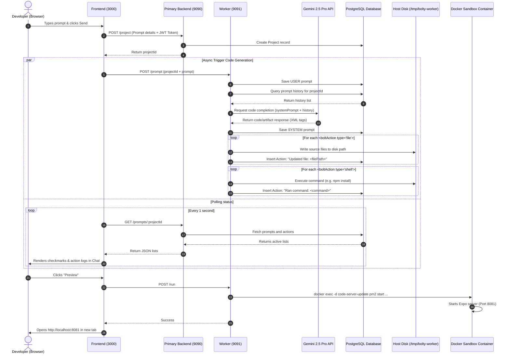
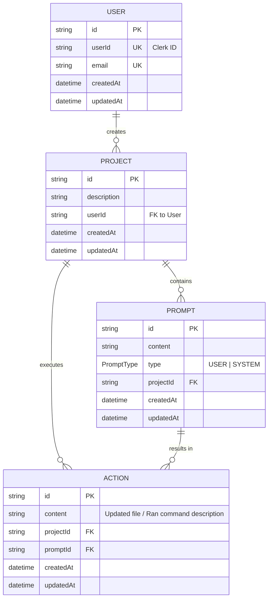

# Project Architecture: Bolt for Mobile Apps

This document details the software architecture, component relationships, data flow, and database design of the **Bolt for Mobile Apps** platform. This monorepo is managed using [Turborepo](https://turbo.build/) and [Bun](https://bun.sh/).

---

## 1. High-Level System Architecture

The application is structured into four main runnable components, supported by a shared data package and a containerized sandbox execution environment:

```mermaid
graph TB
    subgraph Frontend Environment (Browser)
        ClientApp["Next.js Web Frontend\n(Port 3000)"]
        ClerkSDK["Clerk Auth SDK"]
        IframeCS["code-server iframe\n(Port 8080)"]
    end

    subgraph Authentication & Gateway
        Clerk["Clerk Auth Provider"]
    end

    subgraph Host / Server System
        PB["Primary Backend\n(Express - Port 9090)"]
        Worker["Worker Service\n(Bun/Express - Port 9091)"]
        DB[(PostgreSQL Database)]
        HostDir["Host Disk Volume\n(/tmp/bolty-worker)"]
    end

    subgraph Docker Sandbox Container
        CSContainer["code-server-update Container\n(codercom/code-server)"]
        PM2["PM2 Process Manager"]
        Metro["Expo Metro Bundler\n(Port 8081)"]
    end

    %% Auth Flows
    ClientApp -->|Authenticate / Get JWT| ClerkSDK
    ClerkSDK -->|Exchange Session Token| Clerk
    Clerk -->|Webhook: user.created| PB

    %% Client Communication API Flows
    ClientApp -->|Create/List Projects\nBearer JWT| PB
    ClientApp -->|Poll prompts/actions\nBearer JWT| PB
    ClientApp -->|Trigger Code Gen / Run| Worker
    ClientApp -->|Embed Editor| IframeCS
    ClientApp -->|Open Preview| Metro

    %% Backend to Database Flows
    PB -->|Prisma Client| DB
    Worker -->|Prisma Client| DB

    %% Code Execution & Volumes
    Worker -->|Write files & Spawn shell| HostDir
    HostDir <-->|Shared Mount Volume| CSContainer
    Worker -->|Control via Docker exec| CSContainer
    CSContainer -->|Run VS Code Server| IframeCS
    CSContainer -->|Manage Expo Process| PM2
    PM2 -->|Start Expo Dev Server| Metro
```

---

## 2. Frontend Architecture (`apps/frontend`)

The frontend is a modern web interface built on **Next.js 15 (App Router)** and styled using a clean design system.

### Key Components
1. **Authentication**
   - Integrated with Clerk (`@clerk/nextjs`) to handle user login, registration, and session management.
   - Provides JWT token retrieval (`getToken()`) to authorize API requests to the backend services.
2. **Dashboard & Project Creation (`app/page.tsx` & `HomePrompt.tsx`)**
   - User inputs a text prompt (e.g., *"Create a recipe listing app"*).
   - Resolves a POST request to `/project` on the `primary-backend` to initialize the project, generating a unique `projectId`.
   - Sends a secondary POST request to `/prompt` on the `worker` API to kick off Gemini code generation asynchronously.
   - Redirects the user dynamically to the project canvas page: `/project/[projectId]`.
3. **Workspace Canvas (`app/project/[projectId]/page.tsx`)**
   - Divided into two main views:
     - **Left panel**: Consists of [ChatSection.tsx](file:///home/vinit/Webdev/bolt-for-mobile-apps/apps/frontend/components/ChatSection.tsx) showing chronological prompt history and progress logs (actions like files updated, commands run) and [ProjectPrompt.tsx](file:///home/vinit/Webdev/bolt-for-mobile-apps/apps/frontend/components/ProjectPrompt.tsx) for submitting follow-up prompts.
     - **Right panel**: [CodeEditor.tsx](file:///home/vinit/Webdev/bolt-for-mobile-apps/apps/frontend/components/CodeEditor.tsx) containing an `iframe` pointing to the embedded `code-server` editor (allowing manual code inspections and edits), and a **Preview** button to launch the live React Native Expo build.
4. **State Management & Polling Hook ([usePrompts.tsx](file:///home/vinit/Webdev/bolt-for-mobile-apps/apps/frontend/hooks/usePrompts.tsx))**
   - Polling mechanism running every 1 second to fetch `/prompts/:projectId` from the primary-backend.
   - Fetches the active list of prompts and detailed execution logs (Actions) processed by the worker.

---

## 3. Backend & Core Services Architecture

The backend consists of two specialized Express applications:

### A. Primary Backend (`apps/primary-backend`)
An Express server listening on **Port 9090** that manages database persistence, API gateways, and authorization.

* **Clerk Webhook Integrations (`/api/clerk/webhook`)**
  - Subscribes to Clerk’s `user.created` event.
  - Verifies signatures using `@clerk/express/webhooks`.
  - Creates a corresponding `User` record in PostgreSQL.
* **Authentication Middleware (`middleware.ts`)**
  - Extracts Bearer token from the `Authorization` header.
  - Verifies the JWT signature with Clerk's public JWT key using RS256 algorithm.
  - Adds `req.userId` to subsequent request scopes.
* **API Endpoints**
  - `POST /project`: Creates a new project database entry.
  - `GET /projects`: Retrieves all projects associated with the logged-in user.
  - `GET /prompts/:projectId`: Retrieves all prompts and their actions for the project, sorted chronologically.

---

### B. Worker Backend (`apps/worker`)
An Express server running on **Port 9091** executed in the **Bun** runtime. The worker acts as the system coordinator and execution engine.

* **Prompts Endpoint (`POST /prompt`)**
  1. Creates a `USER` prompt entry in the database.
  2. Pulls all historical prompts for the current project to build context.
  3. Prepares a request structure matching Google's Gemini SDK:
     - Formats historical prompts to `user` (USER prompt type) and `model` (SYSTEM prompt type) roles.
     - Inject instructions from the system prompt ([systemPrompt.ts](file:///home/vinit/Webdev/bolt-for-mobile-apps/apps/worker/systemPrompt.ts)), forcing Gemini to format its replies using custom `<boltArtifact>` and `<boltAction>` tags.
  4. Calls the **Gemini 2.5 Pro API** (`generateContent`).
  5. Stores the model's markdown reply in the database as a `SYSTEM` prompt.
  6. Parses and processes XML-like artifact tags.
* **Artifact Parser (`parser.ts`)**
  - Regular expressions look for `<boltArtifact>` wrapper tags.
  - Inside the artifact, `<boltAction>` tags are parsed sequentially:
    - **`type="file" filePath="..."`**: Triggers [onFileUpdate()](file:///home/vinit/Webdev/bolt-for-mobile-apps/apps/worker/os.ts#L12-L39): creates directories, writes contents to `/tmp/bolty-worker/<filePath>`, and creates a DB Action.
    - **`type="shell"`**: Triggers [onShellCommand()](file:///home/vinit/Webdev/bolt-for-mobile-apps/apps/worker/os.ts#L41-L125): executes the shell command in the context of `/tmp/bolty-worker` on the host, handling fallbacks (e.g. retry with `--force` on npm installs). Logs database Action updates.
* **Expo Execution Endpoint (`POST /run`)**
  - Executes container orchestration directly using the host's docker CLI:
    1. Removes any existing Expo instance: `docker exec code-server-update pm2 delete expo`
    2. Runs Expo Metro bundler in background: `docker exec -d code-server-update pm2 start npx --name expo --cwd /tmp/bolty-worker -- expo start`
* **Download Endpoint (`GET /download-all`)**
  - Compresses `/tmp/bolty-worker/` on the fly using `archiver` and serves it as a ZIP file.

---

## 4. Sandbox Execution Environment (`apps/code-server`)

The sandbox provides the browser-based editor environment and holds the running Expo environment.

* **Docker container**: A custom build named `code-server-update` starting from `codercom/code-server:4.96.4`.
* **Node environment**: Configured with Node.js 22 and `pm2` installed globally.
* **Shared Storage**: The host directory `/tmp/bolty-worker` is mounted to `/tmp/bolty-worker` in the container.
* **VS Code Web Server**: Runs code-server pointing to the shared `/tmp/bolty-worker` directory (exposed on port `8080`).
* **Expo Web Server**: Expo Metro bundler runs via `pm2` in the background (exposed on port `8081`).

---

## 5. End-to-End Execution Flow

This sequence diagram illustrates the lifecycle of a prompt creation, database synchronization, code parsing, and preview rendering:



---

## 6. Database Schema & Relationships

The database is built on **PostgreSQL** using **Prisma ORM** (`packages/db`). It defines the following entity model:



### Schema Model Design Decisions
* **`User`**: Provisions user records to sync with external identity provider (Clerk) via webhook.
* **`Project`**: Root container for all generations.
* **`Prompt`**: Records full chronological context (alternating between `USER` prompts and the system `SYSTEM` responses containing XML code block artifacts).
* **`Action`**: Provides granular, step-by-step progress reports (actions) that are linked directly to the parent Prompt and parent Project. These are polled and checked off in the UI.
